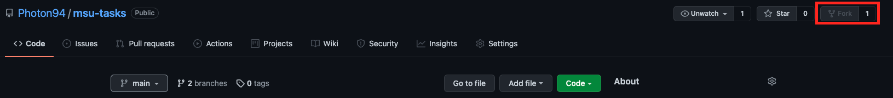
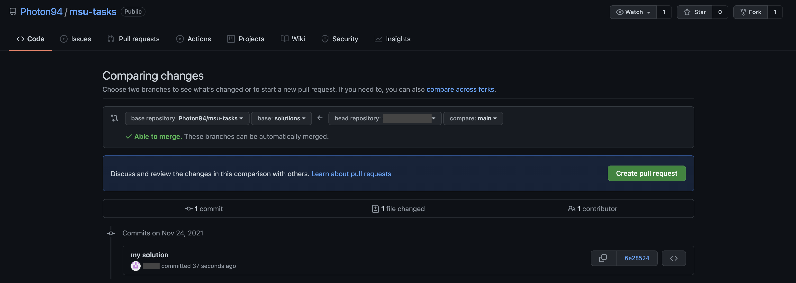

# Описание

Вам предстоит выполнить несколько задач, которые распределены на 2 модуля
`simple` и `medium` в модуле `simple` 13 задач, в каждом модуле есть файл `README.md`
где подробно описаны задачи и методика тестирования

# Как начать

Вам необходимо сделать форк:

этого репозитория, реализовать функции, и после этого
сделать `pull request` в ветку `solution`:

После запроса на слияние будет запущен `action` который
проведет тестирование, если тест завершится успешно вы увидите следующее:

_Примечание: тест может запустится не сразу, если у вас новый аккаунт то для запуска action вам нужно 
дождаться подтверждения с моей стороны_
